## Peristaltic Pump

### Ordering information
* Peristaltic pump: 
  * Boxer 9K 12VDC 315 rpm 3 roller, Boxer 9022.000
    
    We have used exclusively this pump in our work.
    
  * Boxer 9QQ 12VDC 315 rpm 3 roller, Boxer 9022.930
  
    This pump is recommended as a replacement for the 9K in new designs. The tubing and mounting appear compatible with the 9K. The pumping rate is slightly faster: 55 µl per revolution as opposed to 48 µl per revolution with the Boxer 9K, and the same angular speed.

* The motor is mounted on a 3D printed piece in the
  [`motor-mount.stl`](https://github.com/ingolia-lab/turbidostat/tree/master/design/housing/motor-mount.stl)
  file located in [`design/housing`](https://github.com/ingolia-lab/turbidostat/tree/master/design/housing).

* Two-circuit screw-connector barrier strip: Molex Eurostyle 39100-1902, Digi-Key WM12408-ND

* 50 cm JST-PH extension cable, Adafruit 1131

### Equipment

* Diagonal cutters

* Wire strippers

* Small phillips screwdriver

* Heat gun

### Consumables

* Hookup wire (red and black)

* M3 x 12mm pan head phillips screw, 316 stainless: McMaster-Carr 90116A157	

* M3 hex nut, 316 stainless: McMaster-Carr 94150A325	

  Mounting the pump requires four M3 screws and nuts

* M2 x 12mm pan head phillips screw, 316 stainless: McMaster-Carr 90116A022

* M2 hex nut, 316 stainless: McMaster-Carr 94150A305 

  Mounting the barrier strip requires one M2 screw and nut

### Assembly

The peristaltic pump is mounted on a 3-D printed housing and wired to a barrier strip on the same housing, which is connected to a 2-conductor JST cable.

1. Flip the cover latch up until you can pull the cover off of the pump

   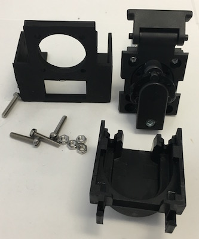

1. Insert the pump motor body into the large hole on the pump stand
1. Align the mounting holes on the pump face with the mounting holes on the stand.
1. Insert M3 x 12mm screws into the holes
1. Thread M3 hex nuts onto the other ends of the screws and tighten

   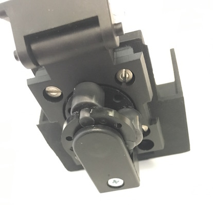

   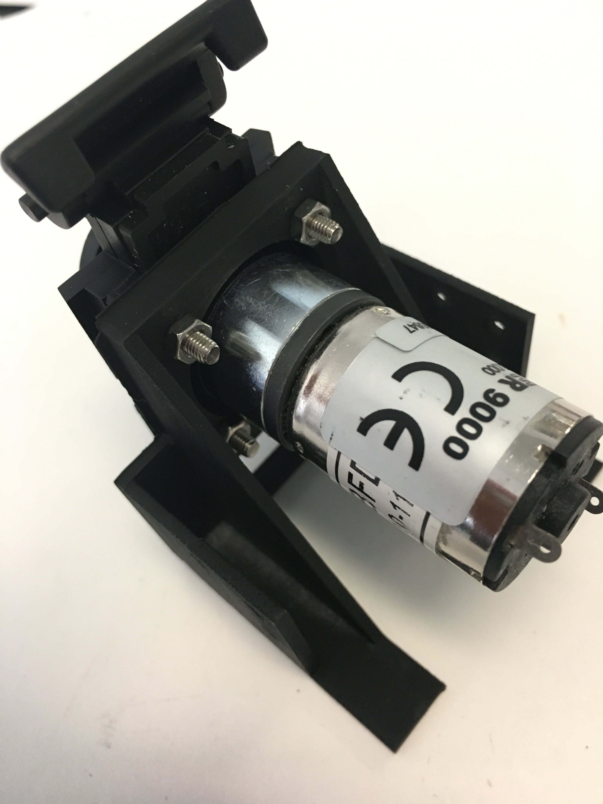

1. Align the hole in the center of the barrier strip with a hole on the side of the pump stand.

   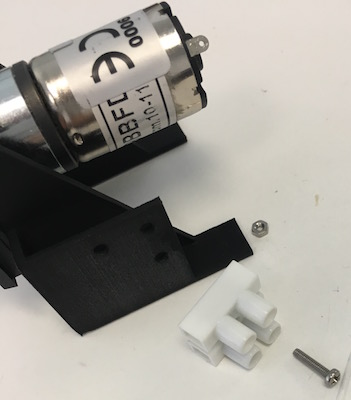

1. Thread an M2 screw through the aligned holes. Attach an M2 hex nut on the other end and tighten.

   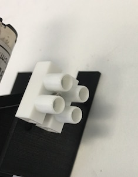

1. Cut matched 5cm pieces of red and black hookup wire. Strip a short length on each end.

   

1. Thread one end of the red wire through the solder tab marked with a small `+`, twist it around, and solder it.

   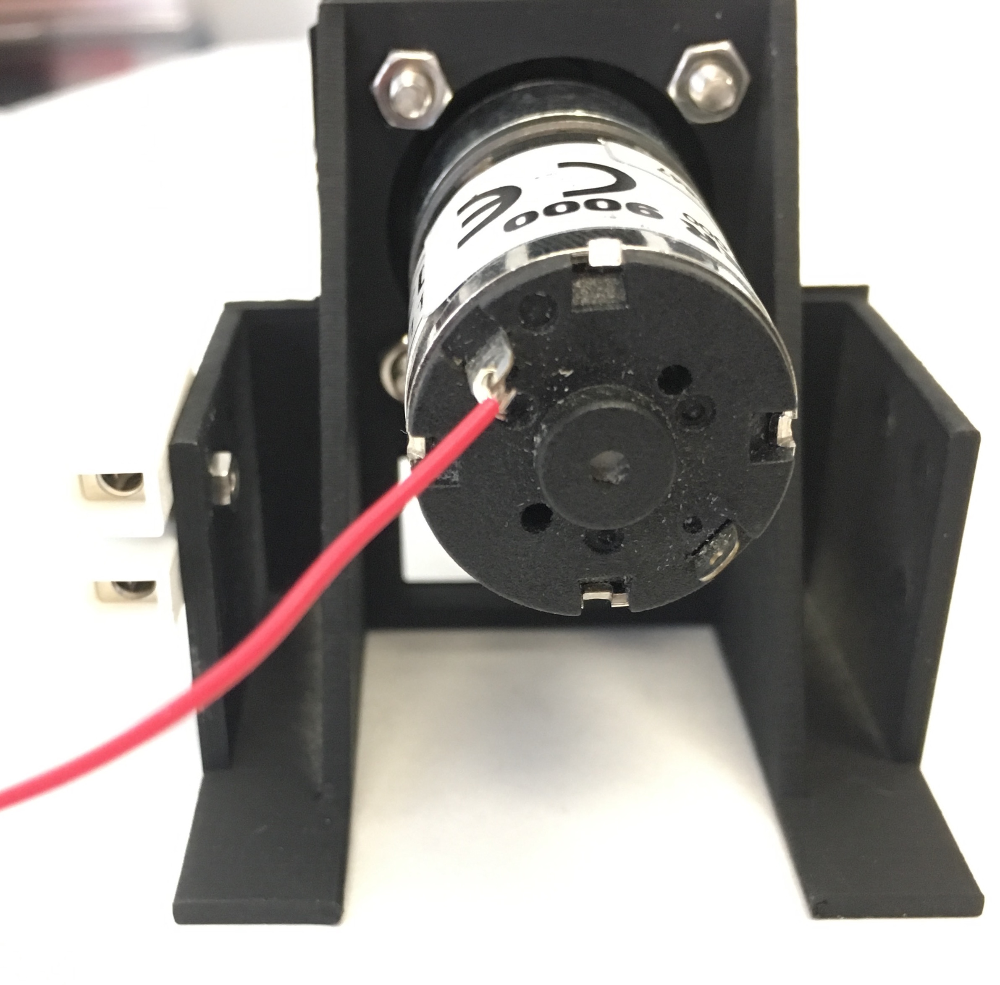

1. Solder the black wire onto the other solder tab in the same way.

   

1. Cut two short (~1 cm) pieces of heat shrink tubing and thread them over the wires until they cover the solder tabs on the motor.

   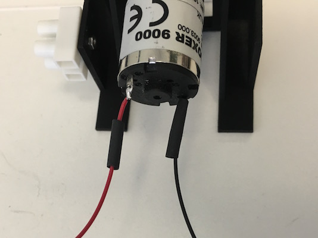

1. Shrink the tubing with a heat gun

   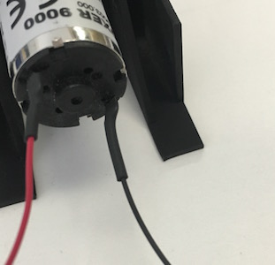

1. Cut a JST PH 2-wire extension cable ~2 cm from the female end

   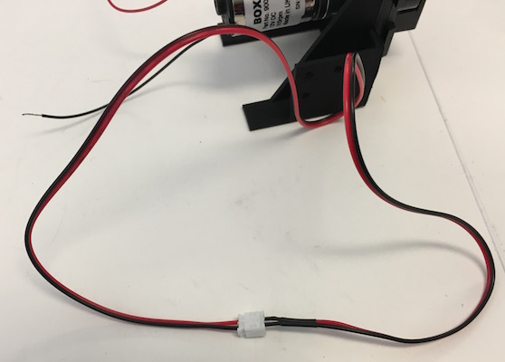
   
   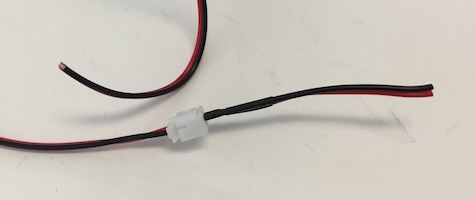
   
1. Strip the wires on both ends of the cut cable and tin the ends

   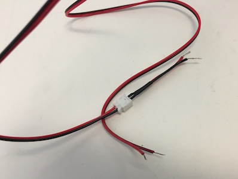

   The short cable with the female connector is connected to a screw terminal on the [printed circuit board](construction-electronics.md).

1. Screw the red and black motor wires into one side of the barrier strip. Screw the red and black wires of the longer JST cable with a male connector into the other side of the barrier strip, matching the red wires together across the strip.

   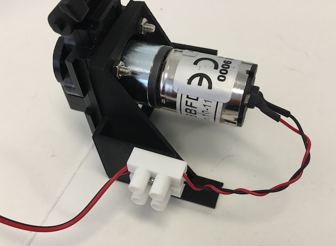
   
1. The JST cable on the motor can plug in to the JST cable on the circuit board

   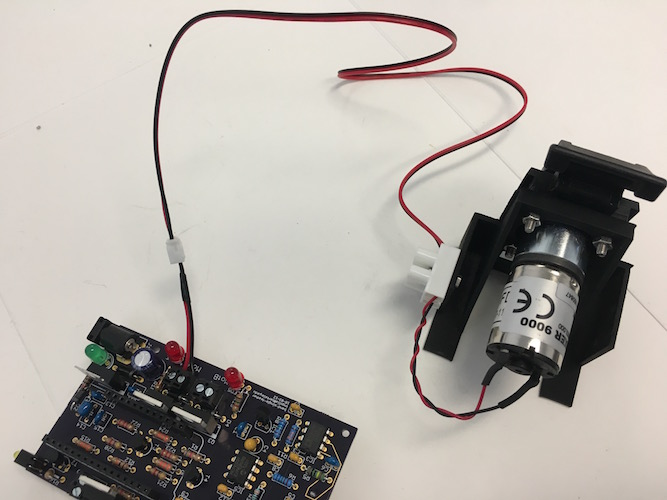
